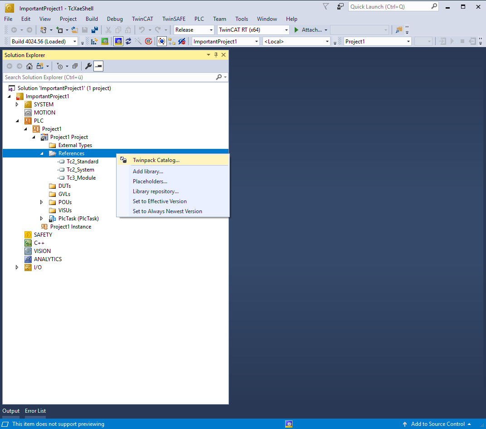
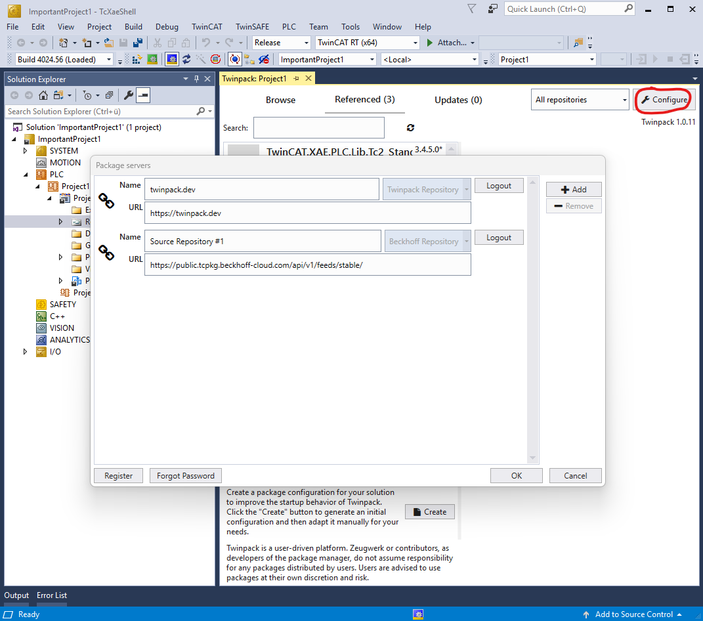
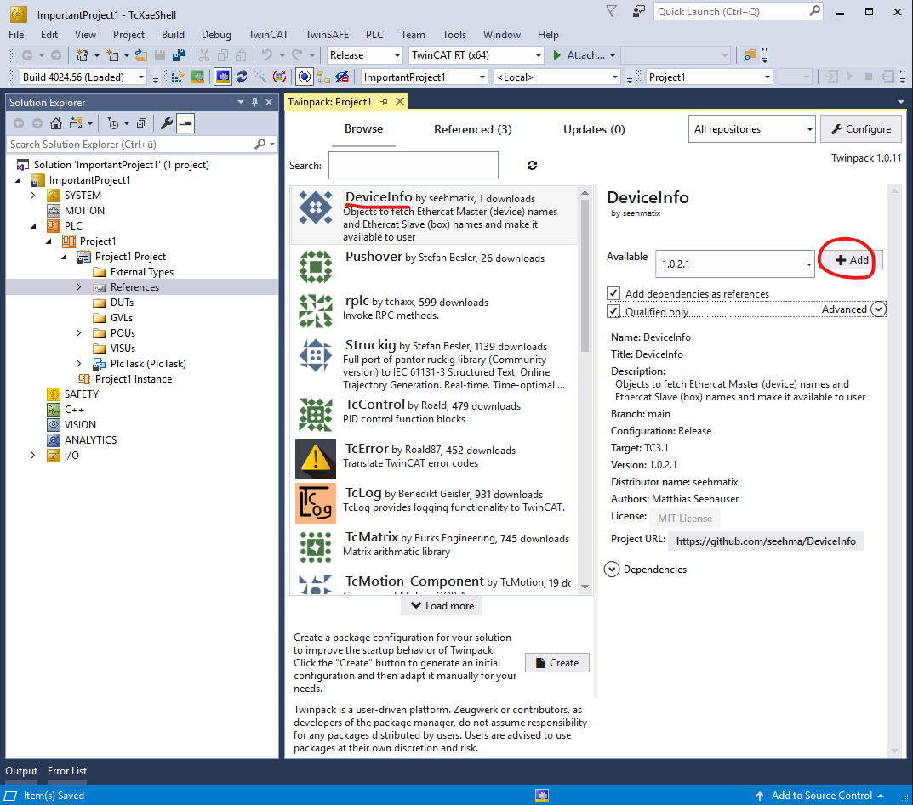
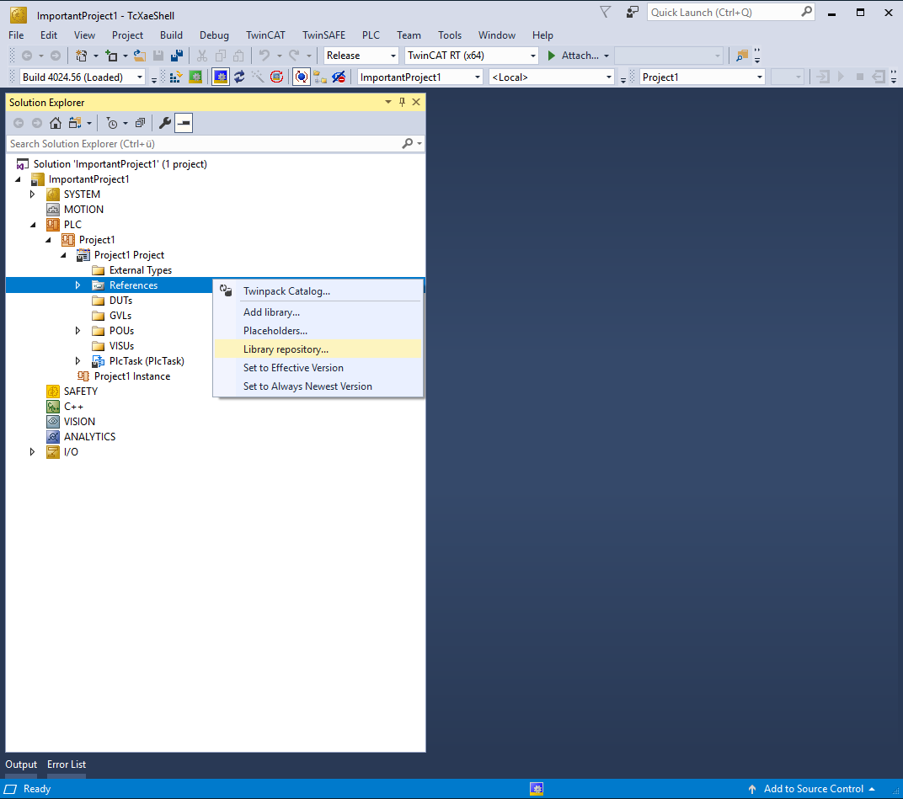
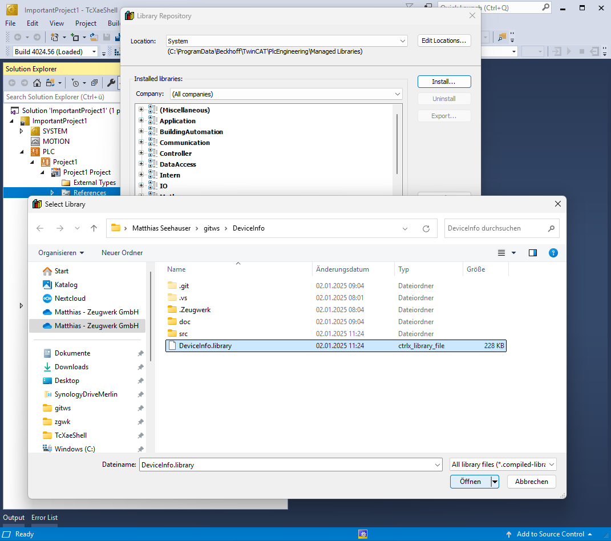
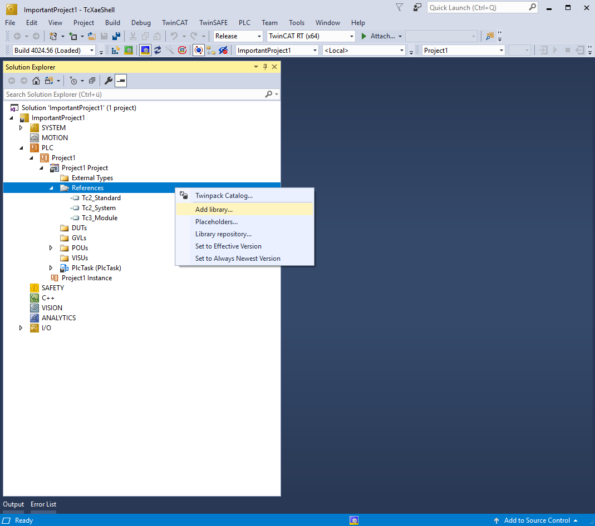
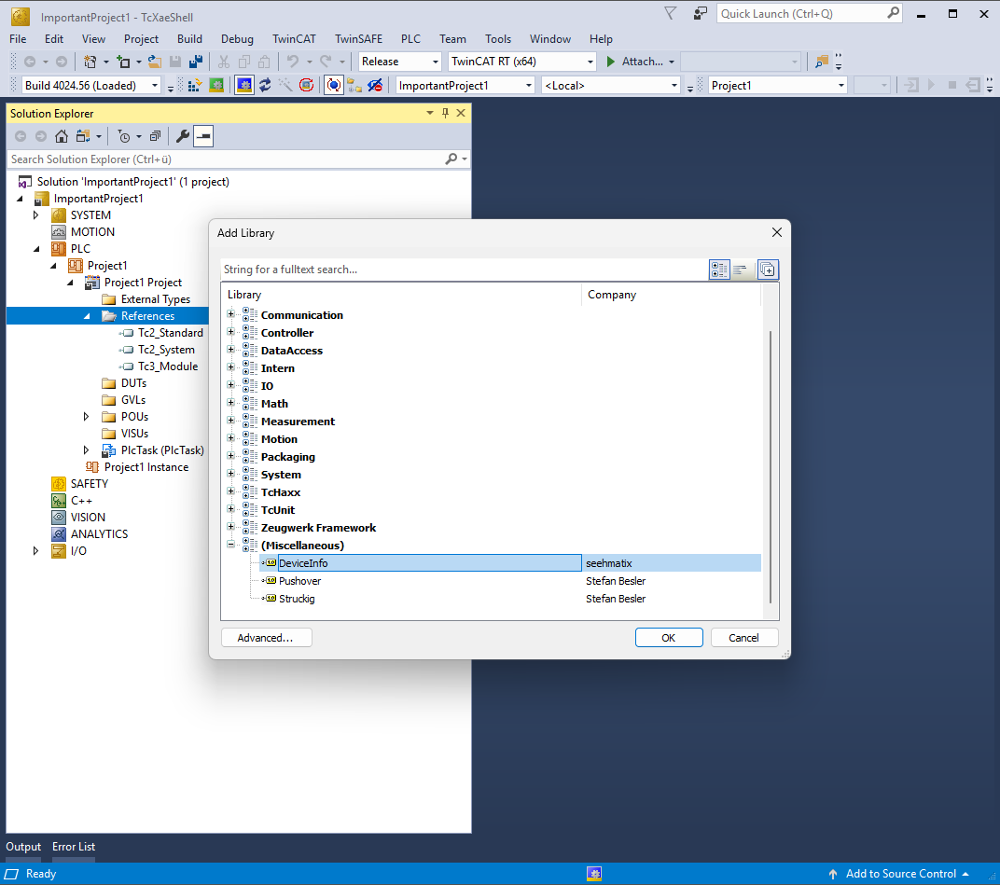

# Getting started
This guide will get you started with DeviceInfo FBs. Here you will learn how to install the library into you TwinCAT environment and use the library to throughout your projects.

## Open new Project
Open TwinCAT XAE Shell and in the dialog, create a new **TwinCAT XAE Project (XML format)**, give the project a proper **Name** and **Location** and click on **Ok** to continue. The next step is to create **PLC** in your TwinCAT project by right-clicking on **PLC** in the **Solution Explorer**. In the contextmenu select **Add new item...**. In the dialog, select **Standard PLC Project**, give it a **Name** and click on **Add**.

Now lets add the library to this project. You can either install this library via Twinpack or do it manually.

## Installation via Twinpack
This library is published via Twinpack and can therefore be easily installed. If you have never used Twinpack, read through the docs at [Twinpack Repo on Github](https://github.com/Zeugwerk/Twinpack) and also on [Zeugwerk Developper Space](https://doc.zeugwerk.dev/userguide/twinpack/twinpack_quickstart.html), download the latest release and install it.

After installation right click on References and click on **Twinpack Catalog**. Click on Browse and search for DeviceInfo library. Click on it and on the right click on Add. Twinpack will now download the library and add it as reference to your project.

<div class="gallery">
  <div class="gallery-item">
    <figure>
      
      <figcaption>TwinCAT XAE Shell</figcaption>
    </figure>
  </div>
  <div class="gallery-item">
    <figure>
      
      <figcaption>Login to Twinpack Repository</figcaption>
    </figure>
  </div> 
  <div class="gallery-item">
    <figure>
      
      <figcaption>Add DeviceInfo Library to References</figcaption>
    </figure>
  </div>    
</div>

## Manual Installation
The DeviceInfo library can either be downloaded from Github as a [precompiled library](https://github.com/seehma/DeviceInfo/releases), or you can clone the [repository](https://github.com/seehma/DeviceInfo) and compile the library yourself. This guide will focus on the former usecase.

First, [get the latest release](todo) of the library, the download will give you a file called "DeviceInfo_1.0.2.1.compiled-library" on your computer. Start the TwinCAT XAE Shell or the Visual Studio Version you are usually using to develop TwinCAT PLCs. Then, in the menubar, select **PLC** and then **Library Repository...** (see figures below)

<div class="gallery">
  <div class="gallery-item">
    <figure>
      
      <figcaption>TwinCAT XAE Shell</figcaption>
    </figure>
  </div>
  <div class="gallery-item">
    <figure>
      
      <figcaption>Select Library from Repository and Install it</figcaption>
    </figure>
  </div>  
  <div class="gallery-item">
    <figure>
      
      <figcaption>Add Library to References</figcaption>
    </figure>
  </div>  
  <div class="gallery-item">
    <figure>
      
      <figcaption>Add Library to References</figcaption>
    </figure>
  </div>    
</div>

In the library-repository dialog click on **Install** and navigate to the file compiled-library file and select it. Then, click on **Open** to install the DeviceInfo library into your TwinCAT environment and you are ready to use it.

## PLC
To write your first program, which utilizes the DeviceInfo library, replace the content of the **MAIN** program by the following source code.

```st
// --- Declaration -------------------------------------
PROGRAM MAIN
VAR
  _deviceInfo : DeviceInfo.DeviceInfo;
  _slaveInfo : DeviceInfo.SlaveInfo;
  _step : ZCore.Step(0, 50);
  _start : BOOL;
  _ecatMasterCount : UINT;
  _ecatName : ZCore.ZString;
  _ecatAmsNetId : Tc2_System.T_AmsNetID;
END_VAR
// --- Implementation ---------------------------------
_deviceInfo.Cyclic();
_slaveInfo.Cyclic();

CASE _step.Index OF
  0:
    IF _start 
    THEN 
      _start := FALSE;
      _step.SetNext(10);
    END_IF
    
  10:
    IF _step.OnEntry()
    THEN
      _deviceInfo.ReadDeviceNamesAsync('');
    END_IF

    IF _deviceInfo.Done 
    THEN
      _ecatMasterCount := _deviceInfo.EthercatMasterCount;
      _ecatName := _deviceInfo.NameArray[0];
      _ecatAmsNetId := _deviceInfo.NetIdArray[0];
      _step.SetNext(20);
    END_IF  
    
  20:
    IF _step.OnEntry()
    THEN
      _slaveInfo.ReadSlaveNamesAsync('', _deviceInfo.DeviceIdArray[0]);
    END_IF
    
    IF _slaveInfo.Done
    THEN
      _step.SetNext(0);
    END_IF
    
END_CASE
```

> [!NOTE]
> Compiling the library yourself and as .library instead of .compiled-library will make some internal variables available to you. While this may facilates debugging 
> for tinkers , the compiled-library has purposly stripped to the variables and application engineer may find useful.
